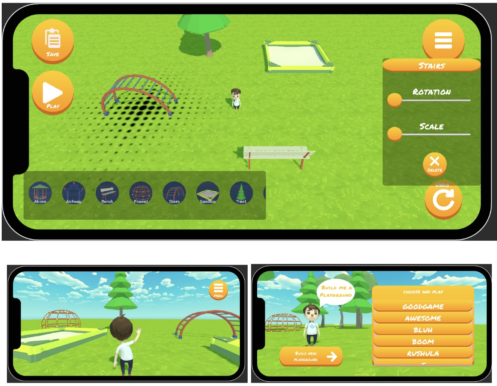
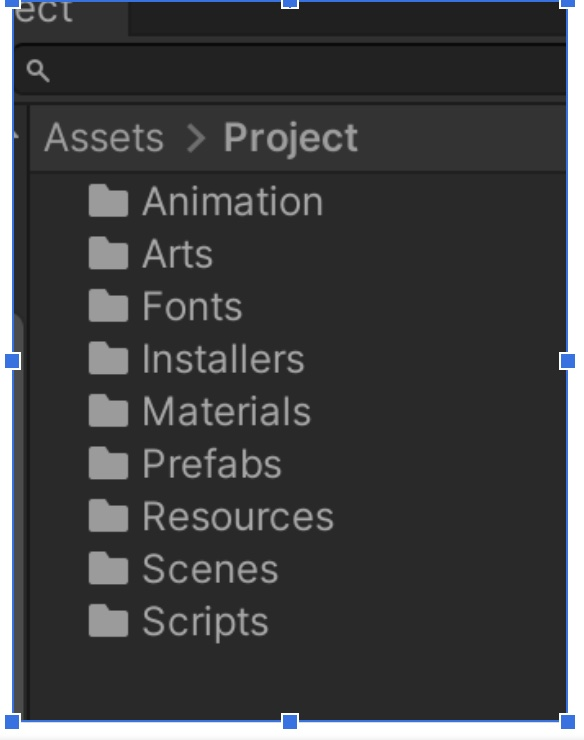

# Playground Maker (ROBLOX Styled Game Editor)
A simple Level Editor project to demonstrate various design patterns and OOP concepts. 

Playground Maker is a Unity project built to fulfill the requirements outlined in the test document. The primary goal is to create a versatile level design tool packed with numerous scene elements and the ability to modify their position, rotation, and scale, as well as undo any changes. Once the level is designed, you can jump in and play it in a separate scene.

As a theme for arts, I chose a story where a kid is asking you to design a playground for him/her. 

## Key Features
- Dependency Injection: Zenject is extensively used throughout the project for dependency injection, ensuring a clean and maintainable architecture. This allows for easy component swapping and testability.
- MVC Pattern: The Model-View-Controller pattern is implemented, ensuring proper separation of concerns between data, logic, and presentation.
- Reactive Data Binding: UniRx is utilized for reactive data binding, allowing for efficient communication between components and automatic UI updates.
- Asynchronous Functionality: UniTask is employed for zero-allocation asynchronous functionality, resulting in better performance and resource management.
- Factory Pattern: The Factory pattern is implemented for dynamic object creation, providing flexibility and extensibility in the codebase.
- Addressables: Unity's Addressables system is used for memory-efficient object instantiation, optimizing asset management, and reducing memory overhead.
- Signal-based Communication: Zenject Signals are used for decoupled communication between components, promoting modularity and maintainability.
- Scriptable Objects: Scriptable objects are used as an editor for game designers to manage assets, facilitating easy content creation and configuration.
- Command Pattern: The Command pattern is implemented to support undo functionality in edit scene mode, offering the potential for additional commands and features.
- Extensive Testing: The project's architecture is designed to be testable using Zenject test fixtures and dependency injection containers, ensuring reliability and maintainability.
- JSON-based database: JSON file-based scene saving and loading system, handled via interface for further extension or technology swap.
- Generic and reusable components: Examples are PopupController or Inputhalding for different purposes in the game.

## Scenes
All scenes are placed in the Assets/Project/Scenes folder. There are three scenes:
- Menu Scene: For menu-related UI and level selector.
- Editor Scene: For the level editor.
- Game Scene: For playing on the level.

## Project Folder Structure

- The user assets and code are placed in the folder named Assets/Project. 
- The project uses several plugins such as Zenject or UniRx, etc. They are placed in the Plugins directory. 
- All the Assetstore assets are placed in the folder named "Third-party".

## Project Folder
The project folder is organized based on file and scene types. Folders such as Prefabs and Scripts have subfolders based on the scene. The elements which are used across multiple scenes are placed in the folder named "Common".
The Scripts folder has further subfolders based on the scene and also their responsibility. `Assets/Project/Scripts/EditorScene` has more subfolders inside, which group them according to their relation. The folder also represents their namespaces in code.

## Installers (Project Entry Point)
In this project, there are four main installers in the Assets/Project/Installers/Resources directory.
- Project Installer: The common scripts and objects container. The key responsibility is to have a PopupUi instance that let's create different types of popups in different places of the game, which is a very usual casual game behavior. It also maintains a scene name registry to load JSON scenes to PlayScene, an addressable registry, etc.
- MenuSceneInstaller: Key responsibility to load menu UI-related prefabs in the scene and load scene selector.
- EditorSceneInstaller: This installer is responsible for configuring the dependencies and bindings specific to the EditorScene. It includes bindings for services like the SceneInteractionService, CameraInputHandler, and SpawnCommand. It also binds the necessary configuration data through ScriptableObject assets.- 
- GameSceneInstaller: This installer is responsible for setting up the dependencies and bindings specific to the GameScene. Similar to the EditorSceneInstaller, it binds the necessary services, configuration data, and other components required for the PlayScene.

## Project Data (Tools for Designers)
Two scriptable object instances act as data containers for the project, located in `Assets/Projects/Resources/Data` folder:
- SpawnAddressablesRegistry: The scriptable object that keeps a reference to the spawnable objects in the scene. Some items from a free Unity asset store asset were picked and converted into addressable. It also keeps a place for thumbnails. The registry is also a tool for game designers to extend the editor scene further with many different objects.
- CameraConfig: This is a settings data holder, typical for better user experience. Designers can manipulate the overall smoothness of the editor scene camera.

## Unit Tests
There are three Unit test scripts which test some of the project's functionalities:
- 'ConfigsTests' ensures the placement of the configs in the right folder.
- 'PersistenceSystemTest' is the test written for file-saving operation tests.
- 'SpawnedItemsRegistryTests' help test object spawning and tracking.
More tests are very easy to add tests due to the presence of ZenjectTestFixture in the project

